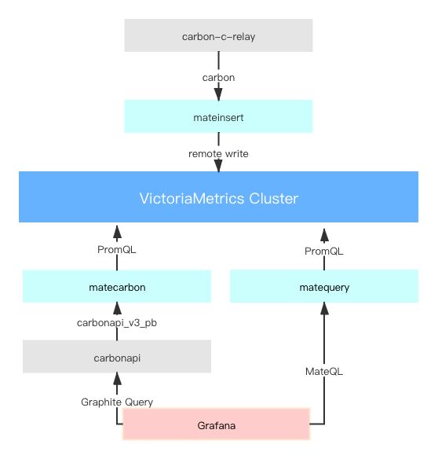

# Promate - Graphite On VictoriaMetrics

> We shared the [promate](https://github.com/zhihu/promate) solution in our [单机 20 亿指标，知乎 Graphite 极致优化！](https://qcon.infoq.cn/2020/shenzhen/presentation/2881)([slides](https://static001.geekbang.org/con/76/pdf/828698018/file/%E5%8D%95%E6%9C%BA%2020%20%E4%BA%BF%E6%8C%87%E6%A0%87%EF%BC%8C%E7%9F%A5%E4%B9%8E%20Graphite%20%E6%9E%81%E8%87%B4%E4%BC%98%E5%8C%96%EF%BC%81-%E7%86%8A%E8%B1%B9.pdf)、[article](https://github.com/zhihu/promate/wiki/%E5%8D%95%E6%9C%BA-20-%E4%BA%BF%E6%8C%87%E6%A0%87%EF%BC%8C%E7%9F%A5%E4%B9%8E-Graphite-%E6%9E%81%E8%87%B4%E4%BC%98%E5%8C%96%EF%BC%81)) talk at [QCon 2020](https://qcon.infoq.cn/2020/shenzhen/). More number in our production: [https://victoriametrics.github.io/CaseStudies.html#zhihu](https://victoriametrics.github.io/CaseStudies.html#zhihu)

Promate is a high-performance graphite storage solution.

Compare with Whisper:

- 10x faster on average; 60-100x faster for complex, long range queries
- 90% storage space reduction, 99.99% IOPS reduction
- 80% reduction in memory and CPU overhead with constant query pressure

This is a comparison of performance from our production environment. Welcome to help us design tests that give reproducible benchmark results.

### Features

- Higher performance with lower cpu, memory, and storage usage, benefit from the excellent [VictoriaMetrics](https://github.com/VictoriaMetrics/VictoriaMetrics)
- Supports almost all graphite functions, benefit from compatible with [carbonapi](https://github.com/go-graphite/carbonapi)
- MateQL language, support query graphite metrics with PromQL
- Real-time aggregation, no loss of accuracy of historical metrics

### Architecture

### Example Config

1. [carbonapi.yaml](examples/carbonapi.yaml)
1. [matecarbon.yaml](examples/matecarbon.yaml)

### Thanks

- [VictoriaMetrics](https://github.com/VictoriaMetrics/VictoriaMetrics) & [metricsql](https://github.com/VictoriaMetrics/metricsql)
- [carbonapi](https://github.com/go-graphite/carbonapi)
- [m3](https://github.com/m3db/m3)

### License

[Apache License 2.0](LICENSE.txt)
